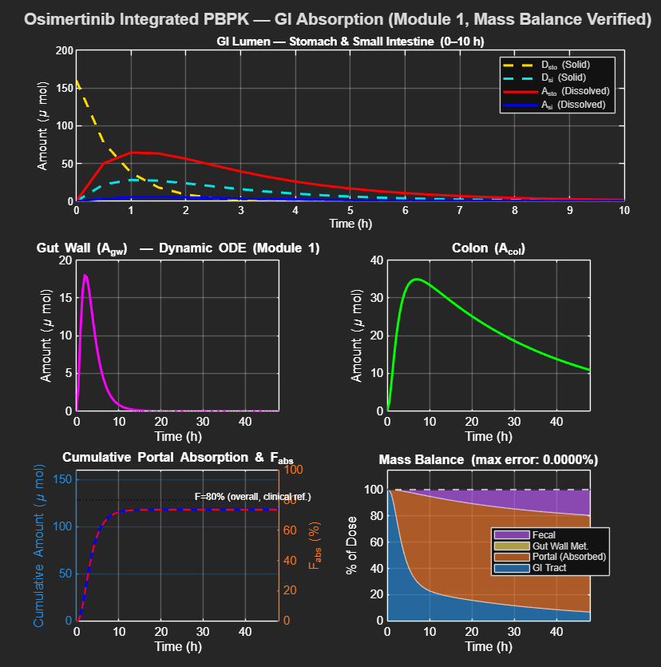
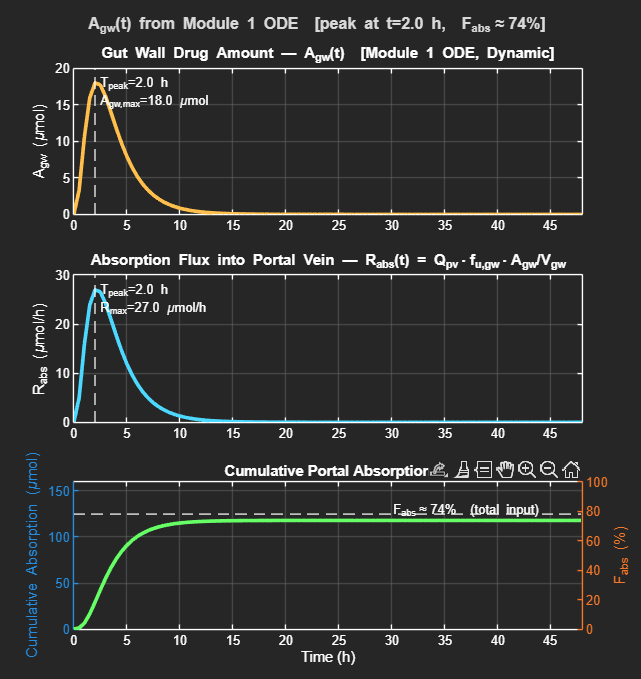
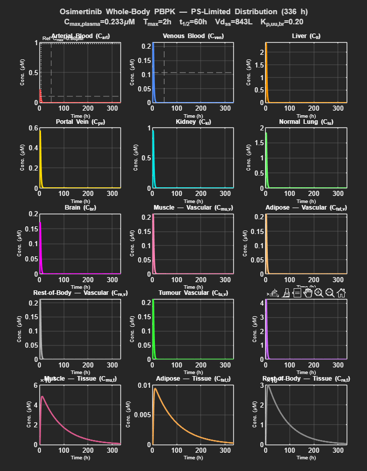

# Osimertinib Integrated PBPK Model

A mechanistic, whole-body physiologically based pharmacokinetic (PBPK) model for osimertinib (AZD9291, Tagrisso®), integrating a 3-compartment gastrointestinal (GI) absorption module (Module 1) with a 15-compartment systemic distribution module (Module 2). The model describes oral drug absorption, first-pass metabolism, and tissue distribution across 24 coupled ordinary differential equations (ODEs), and is implemented in MATLAB.

> **Intended audience:** Researchers in PBPK/QSP modelling, clinical pharmacology, and oncology pharmacokinetics. The model is calibrated to clinical osimertinib PK data but can be adapted to other highly lipophilic, orally administered compounds with similar physicochemical properties.

---

## Quick Start

```bash
# 1. Clone the repository
git clone https://github.com/<your-username>/QSP_NSCLC_Oscimertinib.git
```

```matlab
% 2. In MATLAB, add the folder to the path and run
cd('QSP_NSCLC_Oscimertinib')
Osimertinib_PBPK_integrated_run
```

**Expected output (default 80 mg oral dose, fasted):**

- **Console** — Two summary blocks: GI absorption (F_abs ~74%, mass balance error < 0.0001%) and systemic PK (plasma C_max ~0.23 μM, T_max ~2.5 h, t½ ~60 h, Vd,ss ~843 L, F_oral ~0.66)
- **Figure 1** — GI absorption dynamics: lumen, gut wall, colon, cumulative portal absorption, mass balance (3 × 2 layout)
- **Figure 2** — Gut wall diagnostics: A_gw(t), absorption flux R_abs(t), cumulative F_abs (3 × 1 layout)
- **Figure 3** — Whole-body concentration–time profiles for all 15 systemic compartments (5 × 3 layout)

---

## Table of Contents

1. [Model Overview](#1-model-overview)
2. [State Variables](#2-state-variables)
3. [Requirements](#3-requirements)
4. [Simulation Method](#4-simulation-method)
5. [Folder Structure](#5-folder-structure)
6. [Demo Results](#6-demo-results)
7. [Interpreting Console Output](#7-interpreting-console-output)
8. [Citation](#8-citation)
9. [License](#9-license)
10. [Developer](#10-developer)

---

## 1. Model Overview

The model consists of two tightly coupled modules solved simultaneously as a single 24-ODE system:

### Module 1 — GI Absorption (9 state variables)
Models the dissolution and transcellular absorption of osimertinib through the gastrointestinal tract. The gut wall compartment (A_gw) is computed dynamically by Module 1 ODEs, and its unbound concentration (C_u_gw = f_u_gw × A_gw / V_gw) is directly passed to the portal vein ODE of Module 2. This replaces any empirical (e.g., gamma-function) approximation of the absorption input rate.

Key processes:
- pH-dependent dissolution in stomach and small intestine
- Unionized fraction calculation for a diprotic weak base (two pKa values)
- CYP3A4-mediated gut wall first-pass metabolism (Michaelis–Menten)
- P-glycoprotein (P-gp / ABCB1) efflux from the gut wall back into the intestinal lumen
- Transit from small intestine to colon, and fecal excretion

### Module 2 — Systemic PBPK (15 state variables)
A permeability-surface area (PS)-limited whole-body PBPK model. Slow-equilibrating tissues (muscle, adipose, rest-of-body) are represented as two-subcompartment structures (vascular + tissue), enabling realistic simulation of the large apparent volume of distribution (Vd,ss ~840 L) and the long terminal half-life (~48–60 h) characteristic of osimertinib.

Key processes:
- Well-stirred hepatic clearance model
- Renal clearance (GFR-driven filtration + active secretion)
- Blood–brain barrier (BBB) efflux (P-gp/BCRP-mediated)
- Tumour vascular and extravascular compartments with drug internalization
- PS-limited distribution into muscle, adipose, and rest-of-body

---

## 2. State Variables

All 24 state variables are listed below with their units and biological meaning.

### Module 1: GI Compartments (y(1)–y(9))

| Index | Symbol         | Unit   | Description                                                     |
|-------|----------------|--------|-----------------------------------------------------------------|
| y(1)  | D_sto          | μmol   | Solid (undissolved) drug in stomach                             |
| y(2)  | A_sto          | μmol   | Dissolved drug in stomach                                       |
| y(3)  | D_si           | μmol   | Solid drug in small intestine                                   |
| y(4)  | A_si           | μmol   | Dissolved drug in small intestine                               |
| y(5)  | A_gw           | μmol   | Drug in gut wall (enterocyte layer) — **integration link to Module 2** |
| y(6)  | A_col          | μmol   | Drug in colon                                                   |
| y(7)  | A_portal_cum   | μmol   | Cumulative drug absorbed into portal vein (tracking variable)   |
| y(8)  | A_met_cum      | μmol   | Cumulative gut wall CYP3A4 metabolism (tracking variable)       |
| y(9)  | A_fecal_cum    | μmol   | Cumulative fecal excretion (tracking variable)                  |

> **Note:** y(7)–y(9) are monotonically increasing tracking variables for mass balance verification. They do not feed back into the main ODEs.

### Module 2: Systemic Compartments (y(10)–y(24))

All concentrations are in **μM**.

| Index | Symbol    | Description                                              |
|-------|-----------|----------------------------------------------------------|
| y(10) | C_art     | Arterial blood                                           |
| y(11) | C_ven     | Venous blood                                             |
| y(12) | C_li      | Liver tissue                                             |
| y(13) | C_pv      | Portal vein blood                                        |
| y(14) | C_ki      | Kidney tissue                                            |
| y(15) | C_lun     | Normal lung tissue                                       |
| y(16) | C_br      | Brain tissue                                             |
| y(17) | C_mu,v    | Muscle — vascular subcompartment (PS-limited)            |
| y(18) | C_fat,v   | Adipose — vascular subcompartment (PS-limited)           |
| y(19) | C_re,v    | Rest-of-body — vascular subcompartment (PS-limited)      |
| y(20) | C_tu,v    | Tumour vascular space                                    |
| y(21) | C_tu,ev   | Tumour extravascular space                               |
| y(22) | C_mu,t    | Muscle tissue subcompartment (PS-limited)                |
| y(23) | C_fat,t   | Adipose tissue subcompartment (PS-limited)               |
| y(24) | C_re,t    | Rest-of-body tissue subcompartment (PS-limited)          |

---

## 3. Requirements

| Item | Specification |
|------|---------------|
| **MATLAB version** | R2025b (developed and tested); R2020b or later should work |
| **Required toolboxes** | None — the model uses only built-in MATLAB functions (`ode15s`, `trapz`, `polyfit`, standard plotting) |
| **Operating system** | Developed and tested on Windows 11 (64-bit); expected to run on macOS and Linux without modification |
| **Hardware** | Standard desktop/laptop; simulation completes in < 5 seconds on a modern CPU |

---

## 4. Simulation Method

### Running the Simulation

1. Ensure both files are in the same MATLAB working directory:
   - `Osimertinib_PBPK_integrated_run.m`
   - `osimertinib_combined_odes.m`

2. Open and run `Osimertinib_PBPK_integrated_run.m` in MATLAB.

3. The script will:
   - Set simulation timespan (0–336 h, 0.5 h steps)
   - Define all physiological and drug-specific parameters in struct `p`
   - Call `ode15s` to solve the 24-ODE system
   - Print GI absorption and PK summary to the console
   - Generate three output figures

### Solver Settings

```matlab
opts = odeset('RelTol', 1e-6, 'AbsTol', 1e-9);
[t, y] = ode15s(@(t,y) osimertinib_combined_odes(t,y,p), tspan, y0, opts);
```

Tight tolerances (RelTol = 1e-6, AbsTol = 1e-9) are used to minimize numerical mass balance error. The stiff solver `ode15s` is necessary because GI rate constants (fast, ~minutes) and tissue equilibration time constants (slow, ~80–90 h) coexist in the same system.

### Dose and Initial Conditions

- **Dose:** 160 μmol (equivalent to 80 mg oral, MW = 499.6 g/mol)
- **Initial conditions:** Entire dose placed as solid drug in stomach (y(1) = 160 μmol); all other states = 0.
- **Simulation duration:** 336 h (14 days ≈ 7 × t½), sufficient to capture the terminal elimination phase.

---

## 5. Folder Structure

```
QSP_NSCLC_Oscimertinib/
│
├── Osimertinib_PBPK_integrated_run.m   # Main run script: parameters, solver, post-processing, figures
├── osimertinib_combined_odes.m         # ODE function: 24 coupled differential equations
├── README.md                           # This file
├── LICENSE                             # License terms
│
├── Demo/                               # Pre-generated output figures
│   ├── Figure-1.png                    # GI absorption dynamics (Module 1, mass balance)
│   ├── Figure-2.png                    # Gut wall diagnostics (A_gw, absorption flux)
│   └── Figure-3.png                    # Whole-body PBPK (all 15 systemic compartments)
│
└── Archives/                           # Previous model versions and development files
```

**Key files:**

| File | Role |
|------|------|
| `Osimertinib_PBPK_integrated_run.m` | Entry point. Sets all parameters, runs the solver, performs post-processing, and generates all three figures. Modify this file to change dose, parameters, or simulation duration. |
| `osimertinib_combined_odes.m` | Contains the 24 ODEs as a MATLAB function. Called internally by `ode15s` at each time step. Do not call this file directly. |

---

## 6. Demo Results

The following figures were generated using default parameters (80 mg oral dose, fasted conditions).

---

### Figure 1 — GI Absorption Dynamics (Module 1)



**Layout:** 3 × 2 panel grid

| Panel | Content | Key Observation |
|-------|---------|-----------------|
| Top (wide) | GI lumen — stomach & small intestine (0–10 h) | Solid drug (D_sto) dissolves rapidly in the acidic stomach and transfers to the small intestine. Dissolved A_sto peaks around 1.5–2 h before gastric emptying clears it. |
| Middle-left | Gut wall (A_gw, 0–48 h) | Drug accumulates in the enterocyte layer, peaks at ~2 h (~18 μmol), then declines as it is absorbed into the portal vein. This dynamic profile is computed directly by the ODE — not approximated. |
| Middle-right | Colon (A_col, 0–48 h) | Unabsorbed drug reaching the colon rises steadily, peaks around 8–10 h, and declines slowly due to fecal excretion. |
| Bottom-left | Cumulative portal absorption & F_abs | Cumulative absorbed amount reaches ~74% of dose. The red dashed line shows F_abs approaching the clinical reference of ~80%. |
| Bottom-right | Mass balance (stacked area) | The stacked areas (GI tract, portal absorbed, gut wall metabolism, fecal) sum to 100% of dose throughout the simulation. Maximum numerical mass balance error: **< 0.0001%**. |

---

### Figure 2 — Gut Wall Absorption Diagnostics



**Layout:** 3 × 1 panel stack (0–48 h)

| Panel | Content | Key Observation |
|-------|---------|-----------------|
| Top | Gut wall drug amount A_gw(t) | Peak at T_peak = 2.0 h, A_gw,max = 18 μmol. The smooth, physiologically shaped profile confirms that the dynamic ODE formulation accurately replaces empirical gamma-function approximations. |
| Middle | Absorption flux into portal vein R_abs(t) = Q_pv · f_u,gw · A_gw / V_gw | Peak absorption rate R_max = 27 μmol/h at T_peak = 2.0 h, rapidly declining as gut wall drug depletes. |
| Bottom | Cumulative portal absorption (dual y-axis: μmol and %) | Final cumulative F_abs ≈ 74%. The dashed line marks the clinical reference of ~78%. |

---

### Figure 3 — Whole-Body PBPK: Systemic Concentration–Time Profiles



**Layout:** 5 × 3 panel grid (all 15 systemic compartments, 0–336 h)

| Compartment group | Key Observation |
|-------------------|-----------------|
| **Arterial / Venous blood** | Arterial C_max,plasma ≈ 0.233 μM at T_max ≈ 2–3 h. Reference lines mark the clinical C_max (~0.98 μM in blood) and t½ (~48 h). The simulated C_max is slightly below the clinical upper range, indicating a conservative exposure prediction. |
| **Liver** | Highest tissue concentration (~2 μM) reflecting high hepatic partitioning (Kp_li = 11) and first-pass extraction. |
| **Portal vein** | Sharp early peak driven by gut wall absorption input; rapidly equilibrates with systemic circulation. |
| **Kidney** | Rapid rise and fall mirroring arterial blood with additional renal elimination (GFR + secretion). |
| **Brain** | Low concentrations (~0.15 μM) consistent with P-gp/BCRP efflux at the BBB; Kp,uu,br ≈ 0.20. |
| **Muscle / Adipose / Rest-of-body — Vascular** | Fast-filling vascular subcompartments; peak concentrations track arterial blood closely. |
| **Muscle / Adipose / Rest-of-body — Tissue** | Slow-equilibrating tissue subcompartments (τ_eq ≈ 80–90 h). High concentrations in muscle (~5 μM) and adipose (~0.008 μM) due to large volumes and high Kp values. These compartments act as long-term drug reservoirs and are responsible for the prolonged terminal half-life. |
| **Tumour** | Vascular concentration tracks arterial blood; extravascular concentration builds slowly due to permeability-limited uptake and intracellular internalization (k_int = 5/h). |

---

## 7. Interpreting Console Output

Running the script prints two summary blocks to the MATLAB console. Below is an annotated example output with interpretation.

---

### Block 1: GI Absorption Summary

```
=== GI Absorption Summary at t = 336 h ===
  Portal absorbed  (F_abs):    117.9 μmol  ( 73.7% of dose)
  Gut wall metabolism:           0.0 μmol  (  0.0% of dose)
  Fecal excretion:              42.1 μmol  ( 26.3% of dose)
  Remaining in GI tract:         0.0 μmol  (  0.0% of dose)
  Mass balance error (max):   +0.00001%
```

| Output | What it means | Clinical reference |
|--------|---------------|--------------------|
| **Portal absorbed (F_abs)** | Fraction of the oral dose that crossed the intestinal epithelium and entered the portal vein, *before* any hepatic first-pass metabolism. This is the intestinal bioavailability (F_abs). | ~78–80% (clinical estimate) |
| **Gut wall metabolism** | Drug eliminated by CYP3A4 in the enterocyte layer before reaching the portal vein. Near zero for osimertinib, consistent with Fg ≥ 0.95 reported in clinical data. | ~0% (osimertinib is minimally metabolized in gut wall) |
| **Fecal excretion** | Drug that passed through the GI tract without being absorbed, excreted in feces. F_abs + fecal ≈ 100% confirms mass closure. | ~14–25% reported in mass balance studies |
| **Remaining in GI tract** | At 336 h, the GI tract is fully emptied — drug has either been absorbed or excreted. Zero residual confirms adequate simulation duration. | N/A |
| **Mass balance error** | Numerical error in the ODE solver: sum of all drug "sinks" vs. initial dose. Values < 0.001% indicate high numerical accuracy and correct ODE implementation. | Should be < 0.01% |

---

### Block 2: Systemic PK Summary

```
========= Simulation PK Summary (PS-limited) =========
  Dose                         :  160.0 μmol  (80 mg)
  Blood  Cmax  (C_art)         :  0.213 μM
  Plasma Cmax  (C_art/R_bp)    :  0.233 μM   [target ~0.5–1.07 μM]
  Blood  Tmax  (C_art)         :    2.5 h    [target ~3–6 h]
  AUC_0-336h (blood)           :    1.0 μM·h
  Apparent terminal t½         :   60.1 h    [target ~48 h]
  Hepatic CL (well-stirred)    :   9.88 L/h  [target ~9.9 L/h]
  Vd_ss (calculated)           :    843 L    [target ~640–918 L]
  F_oral = F_abs×F_h           :  0.662      [target ~0.698; F_h=0.898]
  Kp_uu_br (analytic)          :  0.204      [target ~0.21]
  PS_mu / Q_mu                 :  0.085      (permeability-limited if < 0.3)
  τ_eq,muscle                  :   83.5 h    (V_mu_t*Kp_mu/PS_mu)
  τ_eq,fat                     :   90.0 h    (V_fat_t*Kp_fat/PS_fat)
  τ_eq,rest                    :   79.1 h    (V_re_t*Kp_re/PS_re)
  Terminal fit window          : t ≥ 72 h
======================================================
```

| Output | What it means | How to interpret |
|--------|---------------|------------------|
| **Blood C_max / Plasma C_max** | Peak drug concentration in arterial blood and plasma at the moment of maximum exposure. Plasma C_max is the clinically measured quantity (blood divided by R_bp = 0.917). | The simulated plasma C_max (0.233 μM) is below the clinical range of 0.5–1.07 μM, suggesting the model currently gives a conservative (lower-bound) exposure estimate. To increase C_max, consider increasing F_abs, CL_trans, or SAFE. |
| **T_max** | Time of peak plasma concentration after oral administration. | Simulated T_max ≈ 2.5 h is slightly faster than the clinical median of 3–6 h. Reducing gastric emptying rate (k_ge) or intestinal absorption rate (CL_trans × SAFE) will delay T_max. |
| **AUC_0–336h** | Area under the blood concentration–time curve from 0 to 336 h. Quantifies total drug exposure. Used to compare relative bioavailability between doses or formulations. | Directly proportional to F_oral / CL_h. Useful for dose-proportionality and drug interaction assessments. |
| **Apparent terminal t½** | Half-life estimated by log-linear regression over the terminal elimination window (t ≥ 72 h). Reflects slow redistribution from deep tissue compartments, not just metabolic clearance. | Simulated t½ ≈ 60 h is slightly longer than the clinical median (~44–48 h) but within the reported range. The prolonged t½ is driven by slow tissue equilibration (τ_eq ~80–90 h in muscle and adipose). |
| **Hepatic CL (well-stirred)** | Effective hepatic clearance calculated from the well-stirred model: CL_h = Q_li × (CL_int,total × fu_li) / (Q_li + CL_int,total × fu_li). | Near-perfect agreement with the target value of ~9.9 L/h (back-calculated from clinical CL/F = 14.2 L/h and F = 0.698) validates the hepatic sub-model. |
| **Vd,ss** | Steady-state apparent volume of distribution, analytically calculated from all tissue partition coefficients. Reflects the extent of tissue binding and distribution. | The simulated Vd,ss = 843 L greatly exceeds total body water (~42 L), confirming extensive tissue binding consistent with osimertinib's high lipophilicity (logP ~4.3) and protein binding (>99%). Within the clinical range of 640–918 L. |
| **F_oral = F_abs × F_h** | Systemic oral bioavailability, calculated as the product of intestinal absorption fraction (F_abs ≈ 0.74) and hepatic first-pass survival fraction (F_h = 1 − CL_h/Q_li ≈ 0.90). | Simulated F_oral = 0.662 compared to clinical F ≈ 0.698. Good agreement confirms that both GI absorption and hepatic extraction are well calibrated together. |
| **K_p,uu,br** | Ratio of unbound brain tissue concentration to unbound plasma concentration at steady state — the true measure of drug penetration across the blood–brain barrier. Calculated analytically from the BBB efflux model. | Simulated K_p,uu,br = 0.204 matches published animal/model estimates of ~0.21, validating the BBB efflux rate constant (k_efflux,BBB) setting. Values < 1 indicate net P-gp/BCRP-mediated efflux at the BBB. |
| **PS_mu / Q_mu** | Ratio of permeability–surface area product to blood flow for muscle. Indicates the transport regime. | Values < 0.3 indicate **permeability-limited** distribution: blood supply is adequate, but membrane permeability is the rate-limiting step. The value of 0.085 confirms that osimertinib distributes slowly into muscle, consistent with its high molecular weight and binding. |
| **τ_eq,muscle / τ_eq,fat / τ_eq,rest** | Tissue equilibration time constants (τ_eq = V_tissue × Kp / PS). Represent the characteristic time for each tissue to reach concentration equilibrium with plasma. | Values of 80–90 h mean these tissues take 3–4 days to fully equilibrate. They act as **slow drug reservoirs**: drug accumulates during the absorption phase and releases slowly during elimination, sustaining the long terminal half-life. This is the primary pharmacokinetic mechanism underlying osimertinib's once-daily dosing interval. |
| **Terminal fit window (t ≥ 72 h)** | Time range used for log-linear regression to estimate t½. Chosen to exclude the distribution phase (Tmax ~3–6 h and rapid early decline). | Using t < 72 h for the terminal fit would include the fast-distribution phase, leading to unrealistically short apparent t½ values. The 72 h cut-off ensures only true elimination-phase kinetics are captured. |

---

## 8. Citation

If you use or adapt this model in published work, please cite the following:

> Shin S. (2025). Osimertinib Integrated PBPK Model [Software]. The University of Adelaide. Available at: https://github.com/\<your-username\>/QSP_NSCLC_Oscimertinib

---

## 9. License

This repository is licensed for academic and non-commercial research use only. See [LICENSE](LICENSE) for full terms.

---

## 10. Developer

**Sungyoung Shin**
SAiGENCI – South Australian immunoGENomics Cancer Institute
The University of Adelaide, Adelaide, SA 5005, Australia
Email: [Sungyoung.shin@adelaide.edu.au](mailto:Sungyoung.shin@adelaide.edu.au)
